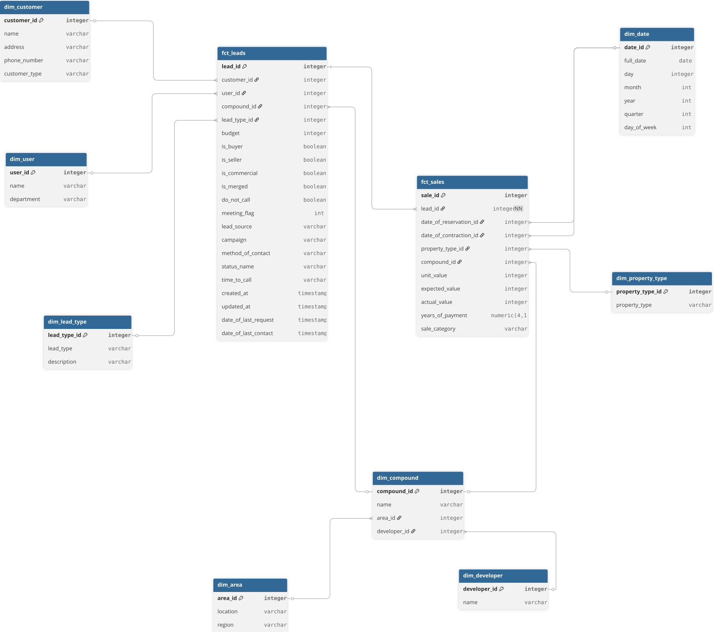

# Real-estate ETL

## Overview
This project simulates a real-world ETL pipeline where raw data is ingested daily, transformed, and loaded into a modeled data warehouse for analytics.

## DWH Model


## Quickstart
1. Start docker services
```bash
docker-compose up -d
```
2. Create **data_source** and **dwh** schemas in postgres.
3. Ingest csv data from **/data** into data_source.leads/sales tables.
4. Active and run airflow DAG **leads_sales_daily_etl**
5. Check loaded data in dwh fact and dim tables.